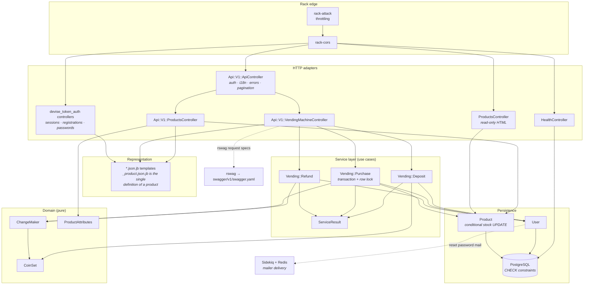
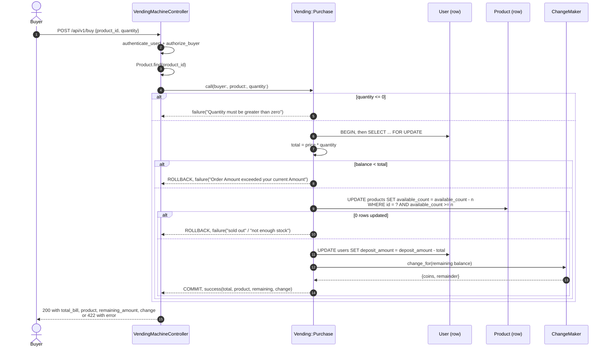

# vendingMachine

A JSON REST API for a coin-operated vending machine, written in Ruby on Rails.
Users register as a **seller** or a **buyer**: sellers stock the machine, buyers
deposit coins, buy products and get their change back. Every amount is a whole
integer number of coin units - there is no floating point anywhere near a
balance.

It was built as a take-home assessment, so it is deliberately a focused API
rather than a product: no admin UI, no dashboard, no feature bolted on for show.

## Captured output

There is no meaningful user interface to screenshot - this is a JSON API with an
OpenAPI document and a throwaway read-only HTML page. What follows was recorded
against a running instance with the demo seeds loaded. The complete session,
including the test suite and the concurrency proof, is in
[`docs/api-walkthrough.md`](docs/api-walkthrough.md).

Authentication is enforced on every `/api/v1` endpoint:

```console
$ curl -i http://127.0.0.1:8400/api/v1/products
HTTP/1.1 401 Unauthorized
{
    "errors": [
        "Authentication is required to perform this action"
    ]
}
```

Listing is paginated, and carries the seller without an N+1:

```console
$ curl -i "http://127.0.0.1:8400/api/v1/products?items=3" -H 'access-token: …' -H 'client: …' -H 'uid: buyer@example.com'
HTTP/1.1 200 OK
Link: <http://127.0.0.1:8400/api/v1/products?items=3&page=1>; rel="first", <http://127.0.0.1:8400/api/v1/products?items=3&page=2>; rel="next", <http://127.0.0.1:8400/api/v1/products?items=3&page=2>; rel="last"
Current-Page: 1
Page-Items: 3
Total-Pages: 2
Total-Count: 6
[
    {
        "id": 1,
        "name": "Sparkling Water",
        "price": 55,
        "available_count": 12,
        "available_amount": 12,
        "seller_id": 1,
        "seller": {
            "id": 1,
            "email": "seller@example.com"
        },
        "created_at": "2026-09-23T23:31:34.218-04:00",
        "updated_at": "2026-09-23T23:31:34.218-04:00"
    },
    },
    ... two more products
]
```

Buying charges the order, releases the stock and reports the change:

```console
$ curl -X POST http://127.0.0.1:8400/api/v1/buy … -d '{"product_id": 2, "quantity": 2}'
{
    "total_bill": 140,
    "product": {
        "id": 2,
        "name": "Cola",
        "price": 70,
        "available_count": 6,
        "available_amount": 6,
        "seller_id": 1,
        "seller": {
            "id": 1,
            "email": "seller@example.com"
        },
        "created_at": "2026-09-23T23:31:34.223-04:00",
        "updated_at": "2026-09-23T23:49:14.403-04:00"
    },
    "remaining_amount": 60,
    "change": {
        "coins": {
            "50": 1,
            "10": 1
        },
        "remainder": 0
    }
}
```

Resetting hands the balance back as coins:

```console
$ curl -X POST http://127.0.0.1:8400/api/v1/reset -H 'access-token: …' -H 'client: …' -H 'uid: buyer@example.com'
{
    "message": "Deposit Amount Reset Successfully",
    "returned_amount": 60,
    "change": {
        "coins": {
            "50": 1,
            "10": 1
        },
        "remainder": 0
    }
}
```

Roles are enforced - a buyer cannot stock the machine:

```console
$ curl -i -X POST http://127.0.0.1:8400/api/v1/products … -d '{"name": "Contraband", "price": 1, "available_count": 1}'
HTTP/1.1 403 Forbidden
{
    "error": "Only sellers can manage products"
}
```

## Architecture

The application is layered, and the dependencies point inward. Controllers are
HTTP adapters: they parse parameters, call exactly one service and render the
result. Services own the business rules and the transaction boundary. The
domain objects underneath them are pure - no ActiveRecord, no HTTP, no clock -
and are therefore the cheapest part of the system to test.



## Buying: the critical path

A purchase is a read-modify-write across two rows - a balance and a stock
count - so it is the only place in the application where concurrency can cost
real money. It is one transaction, the buyer row is locked, and the stock is
removed with a conditional `UPDATE` that the database evaluates rather than the
application.



## Quickstart

### Docker (one command)

```bash
docker compose up --build
```

That starts PostgreSQL, Redis, the API and a Sidekiq worker; the web container
waits for the database, creates and migrates it, loads the demo seeds and then
serves on **http://localhost:8400**.

| URL | What |
| --- | --- |
| `http://localhost:8400/api-docs` | Swagger UI over the generated OpenAPI document |
| `http://localhost:8400/health` | Liveness probe used by the container healthcheck |
| `http://localhost:8400/products` | Read-only HTML listing |
| `http://localhost:8400/jobmonitor` | Sidekiq web UI |

Demo accounts created by `db/seeds.rb`: `seller@example.com` and
`buyer@example.com`, both with the password `password123`.

Tear the stack down with `docker compose down -v`.

### Without Docker

Requires Ruby 2.7.2 (`.ruby-version`), PostgreSQL and Redis.

```bash
cp .env.sample .env          # then fill in the values for your machine
bundle install
bundle exec rake db:create db:migrate db:seed
bundle exec rails server -p 8400
```

## Configuration

Every variable the application reads.

| Variable | Required | Default | What it does |
| --- | --- | --- | --- |
| `DB_HOST` | no | `localhost` | PostgreSQL host |
| `DB_USERNAME` | no | `postgres` | PostgreSQL user |
| `DB_PASSWORD` | no | `postgres` | PostgreSQL password |
| `DB_NAME` | no | `vending_machine` | Database name; the test database is `<name>-test` |
| `DB_POOL` | no | `RAILS_MAX_THREADS`, else `5` | ActiveRecord connection pool size |
| `RAILS_MAX_THREADS` | no | `5` | Puma thread pool, and the default connection pool |
| `RAILS_MIN_THREADS` | no | `RAILS_MAX_THREADS` | Puma minimum threads |
| `PORT` | no | `3000` | Port Puma binds to |
| `RAILS_ENV` | no | `development` | Rails environment |
| `REDIS_URL` | in production | none | Sidekiq client and server; Action Cable falls back to `redis://localhost:6379/1` |
| `COIN_DENOMINATIONS` | no | `5,10,20,50,100` | Comma-separated coins the machine accepts and pays out |
| `SEED_PASSWORD` | no | `password123` | Password given to the demo accounts by `rails db:seed` |
| `TZ` | no | `Eastern Time (US & Canada)` | `config.time_zone` |
| `SITE_TITLE` | for password-reset mail | none | Rendered in the reset-password email; the mailer raises without it |
| `SERVER_URL` | for mail | none | `default_url_options[:host]` for mailer links |
| `MAILER_DOMAIN` | for mail | none | SMTP domain |
| `SENDGRID_API_KEY` | for mail | none | SMTP password (the username is the literal `apikey`) |
| `DEFAULT_FROM_EMAIL_ADDRESS` | for mail | `no-reply@example.com` for Devise | From/reply-to address |
| `JOB_MONITOR_USERNAME` | in production | none | HTTP basic auth user for `/jobmonitor` |
| `JOB_MONITOR_PASSWORD` | in production | none | HTTP basic auth password for `/jobmonitor` |
| `RAILS_SERVE_STATIC_FILES` | no | unset | Serve `public/` from Rails in production |
| `RAILS_LOG_TO_STDOUT` | no | unset | Log to stdout in production |

`JOB_MONITOR_USERNAME` / `JOB_MONITOR_PASSWORD` have **no default on purpose**.
In production the Sidekiq UI is wrapped in basic auth that reads them with
`ENV.fetch` and no fallback, so leaving them unset makes every request to
`/jobmonitor` fail rather than succeed with a guessable password. The database
credentials, by contrast, *do* default to `postgres`/`postgres` for local
convenience - set them explicitly anywhere that matters.

## Development

```bash
bundle exec rspec                    # the whole suite
bundle exec rspec spec/services      # one directory, or one file
bundle exec rake linters             # rubocop + reek; `-- -a` to autocorrect
bundle exec rake swagger:generate    # regenerate swagger/v1/swagger.yaml
bundle exec rake db:seed             # reload the demo data (idempotent)
```

Both linters are expected to come back clean - there is no `.rubocop_todo.yml`
and no suppressed backlog. A SimpleCov report is written to `coverage/` (which
is gitignored) on every run.

```console
$ bundle exec rspec
...................................................................................................................................................................................................................................................................................................................................................................................

Finished in 5.63 seconds (files took 1.63 seconds to load)
371 examples, 0 failures

Randomized with seed 2807

Coverage report generated for RSpec to /Users/dev/Documents/Projects/WAMO/githubs/all_projects/vendingMachine/coverage. 1693 / 1716 LOC (98.66%) covered.
```

## Project structure

```
app/
  controllers/
    api/v1/                     JSON API (ActionController::API)
      api_controller.rb         base: auth, i18n, error handling, pagination
      products_controller.rb    product CRUD + seller authorization
      vending_machine_controller.rb   deposit / buy / reset - HTTP only
      sessions_ registrations_ passwords_ token_validations_ users_
    concerns/
      act_as_api_request.rb     forces JSON, checks content type, skips sessions
      exception_handler.rb      rescue_from -> JSON error bodies
      localizable.rb            per-request I18n locale
      paginatable.rb            bounded index responses + pagination headers
    application_controller.rb   CSRF policy for the non-API controllers
    health_controller.rb        liveness probe
    products_controller.rb      read-only HTML listing
  domain/                       pure value objects, no Rails dependencies
    change_maker.rb             balance -> coins + remainder
    coin_set.rb                 the denominations this machine accepts
    product_attributes.rb       normalises the accepted parameter shapes
  services/
    application_service.rb      .call builds and runs one use case
    service_result.rb           success/failure + payload, the only return type
    vending/
      deposit.rb                accept one coin
      purchase.rb               charge + release stock, transactionally
      refund.rb                 empty the balance, dispense coins
  models/                       User, Product
  views/
    api/v1/products/_product.json.jb   the single product representation
    api/v1/**/*.json.jb                jb JSON templates
    products/*.html.erb                read-only HTML
config/
  routes.rb                     HTML pages, /health, /api/v1, rswag, sidekiq
  initializers/                 devise, devise_token_auth, rack_attack, sidekiq, rswag, pagy
db/
  migrate/ schema.rb seeds.rb   seeds are idempotent and refuse to run in production
docs/
  api-walkthrough.md            captured request/response session
lib/
  gem_extensions/devise/        token generator override
  tasks/                        annotate, linters, swagger
rubocop/                        a custom cop and the shared rubocop config
spec/                           domain, services, models, requests, routing, views
swagger/v1/swagger.yaml         generated OpenAPI 3.0 document, with real examples
```

## Design notes

**Layering.** The purchase rules used to live in the controller. They are now a
command object, `Vending::Purchase`, that returns a `ServiceResult`; the `buy`
action is eleven lines that parse, delegate and render. That matters for more than tidiness: the
concurrency proof below drives the service directly, with no HTTP stack and no
authentication in the way, which is what makes it fast and deterministic enough
to keep in the default suite.

**Pure domain objects.** `CoinSet` and `ChangeMaker` have no Rails dependency
at all. `ChangeMaker` is greedy, which is optimal for a canonical coin system
like the default 5/10/20/50/100; a custom non-canonical set may get more coins
than the theoretical minimum, and that is documented at the top of the class
rather than hidden. A balance the coin set cannot pay exactly - 103, say -
comes back as `{"coins": {"100": 1}, "remainder": 3}`. The machine never
silently swallows the difference.

**Overselling.** This is the bug that matters in a vending machine, and there
are three independent guards:

1. `Vending::Purchase` takes a `SELECT ... FOR UPDATE` on the buyer, so one
   wallet cannot be spent twice concurrently.
2. `Product#decrement_stock!` is a single conditional
   `UPDATE ... WHERE available_count >= n`. Under READ COMMITTED, PostgreSQL
   re-evaluates that predicate after taking the row lock, so exactly one of two
   buyers racing for the last item wins.
3. A `CHECK (available_count >= 0)` constraint on `products` and
   `CHECK (deposit_amount >= 0)` on `users`. Even a future bug in the
   application layer cannot persist an impossible number.

Locks are always taken buyer-then-product, so two sessions cannot build a cycle
and deadlock.

`spec/services/vending/purchase_concurrency_spec.rb` proves it: four threads on
four real connections race for two units of stock, and separately for one wallet
holding 30. Exactly two and exactly three purchases succeed. Swapping
`decrement_stock!` for a naive read-modify-write makes 7 of those 10 examples
fail - all four buyers get served from two units, and the stock settles at 1.

**Unbounded queries.** `GET /api/v1/products` used to be `Product.all`. It is
now paginated through the `Paginatable` concern: 25 per page by default, a
caller-supplied `?items=` clamped at 100, and pagy's standard `Link`,
`Total-Count`, `Total-Pages`, `Current-Page` and `Page-Items` response headers.
The HTML listing is paginated the same way.

**N+1.** Putting the seller into the product payload creates a textbook N+1, so
the index eager-loads it. A full page of 25 products costs five queries - two
token lookups from devise_token_auth, one `COUNT`, one page of products and one
preload of their sellers - and that number is asserted by a spec that counts
`sql.active_record` notifications. Removing the `includes(:seller)` makes Bullet
raise `UnoptimizedQueryError` and fails 12 of the 14 pagination examples.

**Indexes.** Deliberately none added. Every query the application issues is on a
primary key or on `products.seller_id`, which is already indexed; adding more
would be decoration.

**One representation per resource.** The products endpoints used to
`render json: @product`, which serialises whatever columns happen to exist, and
the `.json.jb` templates next to them were dead code. Index, show, create,
update and the product embedded in a `buy` response now all render
`_product.json.jb`, so the shape cannot drift between endpoints.

**The extensibility seam: `CoinSet`.** The accepted denominations were a frozen
array inside the controller. They are now a value object that `CoinSet.default`
builds from `COIN_DENOMINATIONS`, and every service takes a `coin_set:` keyword
argument. Running the same machine in another currency is a configuration
change, and a test that needs different coins passes its own instance instead of
stubbing a constant. That is the seam a future developer would actually reach
for; a plugin architecture here would be invention.

**CSRF and content negotiation.** A client that posted a JSON body without an
`Accept` header used to get a `500 InvalidAuthenticityToken` from
`POST /api/v1/users/sign_in`, because the request negotiated `text/html`.
`ApplicationController` now treats an `application/json` content type as proof of
an API client (a browser cannot send one cross-origin without a preflight), and
`ActAsApiRequest` pins the response format to JSON. Covered by
`spec/requests/api/v1/sessions/json_content_type_spec.rb`.

## Limitations

- **There is no coin inventory.** The machine tracks one integer balance per
  buyer. `ChangeMaker` computes which coins *would* be dispensed, but nothing
  tracks how many 50s the machine physically holds, so it will happily "pay out"
  coins it does not have. Modelling a float would mean a new table and a second
  concurrency story; it is out of scope for the assessment.
- **No refunds, order history or receipts.** A purchase mutates a balance and a
  stock count and returns a body. Nothing is recorded, so there is no ledger to
  reconcile against and no way to answer "what did this buyer buy last week".
- **Sidekiq is configured but nearly idle.** The only background work is
  delivering the Devise reset-password email. The worker exists so the wiring is
  demonstrably correct, not because there is a queue to drain.
- **The HTML pages are a debugging convenience.** `/products` is unauthenticated
  and read-only, has no styling, and exposes no write actions. It is not a user
  interface and is not trying to be one.
- **Authorization is role checks in controllers.** With two roles and five
  endpoints that is the right size; a policy object layer (Pundit and friends)
  would be more machinery than the rules justify.
- **No rate limiting on the money endpoints.** rack-attack throttles requests
  per IP and sign-ins per IP and per email, but `deposit` and `buy` are not
  separately throttled.
- **The API is versioned by path only.** There is no deprecation mechanism and
  no content negotiation between versions; `/api/v2` would be a new namespace.
